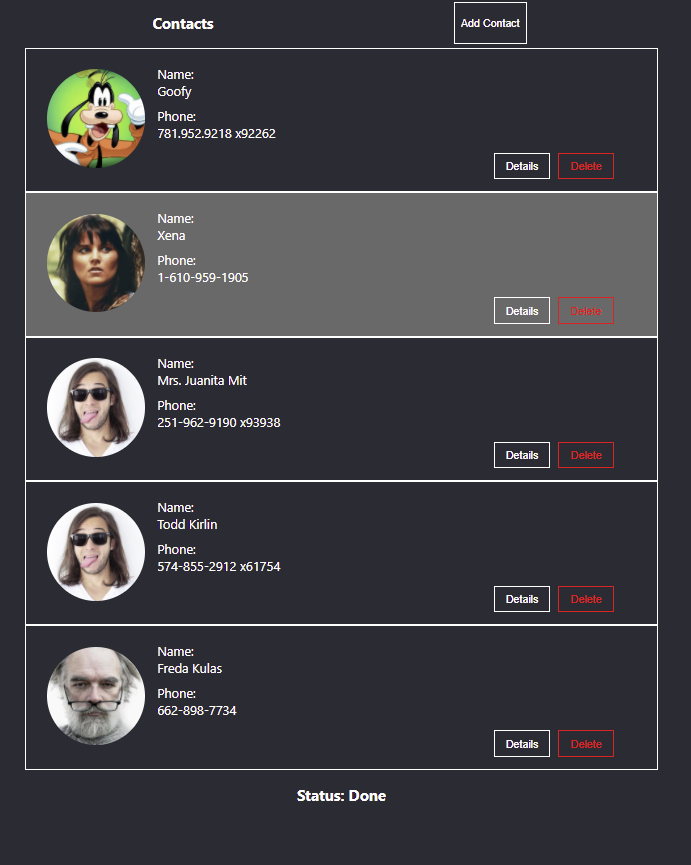

# Contact App

This is the simple application that lists contact

## Features
- Lists contacts at first loading
- Summary view of contacts list
- Dispay contact in detail when click on item
- Create, Update, Remove, Fetch with apis
  
## Topic
- My own `Mini Redux` for state management with context api
- Without any third-party libraries

## How to use
1. Clone the repo in your local
    ``` 
    git clone https://github.com/FrozenIce0617/Contact-App.git
    ```

2. This project is bootstrapped by `create-react-app`
    
    in the root directory
    ```
    yarn or yarn install
    ```
    ```
    yarn start
    ```

<p align="center">
    
</p>
